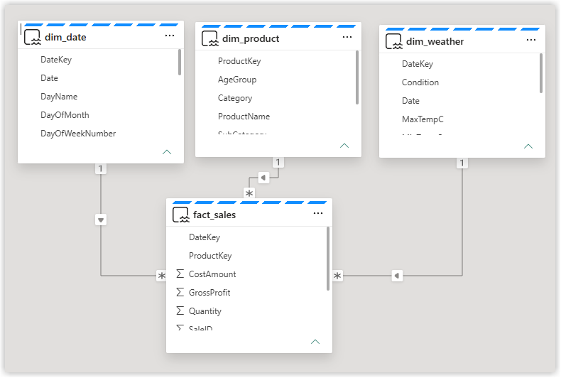

# Demo Setup

The demo is sales data for a beach shop. There are 4 tables in a lakehouse and semantic models build from the data to be the data source for the agents. This repo contains the 4 files to create those tables.

## Populate Lakehouse Tables

::: info Instructions
1. Create a lakehouse
1. Create a new notebook and attach the Lakehouse
1. Copy in the code below
:::

### Import code
```Python
# Fabric Notebook (PySpark + Pandas)
# Reads public CSV URLs via pandas, converts to Spark, writes Delta tables

import pandas as pd
basepath = "https://hatfullofdata.github.io/Sessions/Lets%20Build%20a%20Data%20Agent/Datafiles/"
files = [
    {"url": f"{basepath}dim_date.csv","table": "dim_date"},
    {"url": f"{basepath}dim_product.csv","table": "dim_product"},
    {"url": f"{basepath}dim_weather.csv","table": "dim_weather"},
    {"url": f"{basepath}fact_sales.csv","table": "fact_sales"},

]

for f in files:
    url = f["url"]
    table = f["table"]
    print(f"Loading {url} -> {table}")

    # 1) Download CSV with pandas
    pdf = pd.read_csv(url)

    # 2) Optional cleanup of column names
    pdf.columns = (
        pdf.columns.str.strip()
                   .str.replace(" ", "_", regex=False)
                   .str.replace(r"[^A-Za-z0-9_]", "", regex=True)
    )

    # 3) Convert to Spark DataFrame
    sdf = spark.createDataFrame(pdf)

    # 4) Write to default lakehouse as Delta table
    (sdf.write
        .format("delta")
        .mode("overwrite")
        .saveAsTable(table))

    print(f"Done: {table} ({sdf.count()} rows)")

print("All tables loaded.")
```

## Create Bella Semantic Model

Create a semantic model for the Bella Agent including all 4 tables. Add in relationships using DateKey and ProductKey fields.



Add in a measure called Total Sales for the sum of the SalesAmount in fact_sales. Format this measure to be a currency.

```DAX
Total Sales = SUM( fact_sales[SalesAmount] )
```

## Create Casper Semantic Model

Repeat the steps for the Bella model.

For the IsOpen column in the dim_date add the following description

```
Indicates whether the business is open on this date. Values are Yes or No
```


For the Casper demo add in this agent instruction
```
When calculating averages do not include days when the store is not open
```

## Daryl Scripts

For the fourth agent you can run tmdl scripts to enhance the semantic model.

### dim_date

```C
createOrReplace

	ref table dim_date

		/// Calendar date represented by this row.
		column Date
			dataType: dateTime
			isKey
			formatString: General Date
			lineageTag: f09a4541-c79b-4cee-a24a-36b1c8aaed80
			sourceLineageTag: Date
			isDefaultLabel
			summarizeBy: none
			sourceColumn: Date

			changedProperty = Description

			annotation SummarizationSetBy = Automatic

		/// Unique date key in YYYYMMDD format used to join this date dimension to fact tables.
		column DateKey
			dataType: int64
			formatString: 0
			lineageTag: 2f4c1d52-5005-4573-a80c-83c37ec60cd2
			sourceLineageTag: DateKey
			summarizeBy: none
			sourceColumn: DateKey

			changedProperty = Description

			annotation SummarizationSetBy = Automatic

		/// Full weekday name for the date, such as Monday.
		column DayName
			dataType: string
			lineageTag: f8c8a6db-c2b4-4611-8f94-09dde68b269c
			sourceLineageTag: DayName
			summarizeBy: none
			sourceColumn: DayName

			changedProperty = Description

			annotation SummarizationSetBy = Automatic

		/// Day number within the month, from 1 to 31.
		column DayOfMonth
			dataType: int64
			formatString: 0
			lineageTag: 9e254a5d-ef7f-4f80-8e1b-b0f66a21f6b9
			sourceLineageTag: DayOfMonth
			summarizeBy: none
			sourceColumn: DayOfMonth

			changedProperty = Description

			annotation SummarizationSetBy = Automatic

		/// Day of week number for the date, where Monday = 1 and Sunday = 7, used for weekday sorting and filtering.
		column DayOfWeekNumber
			dataType: int64
			formatString: 0
			lineageTag: dd24b438-c9ce-4092-b30d-486daaeafefa
			sourceLineageTag: DayOfWeekNumber
			summarizeBy: none
			sourceColumn: DayOfWeekNumber

			changedProperty = Description

			annotation SummarizationSetBy = Automatic

		/// Indicates whether the date is a bank holiday. Values are Yes or No.
		column IsBankHoliday
			dataType: string
			lineageTag: 83c8d10a-0dff-4169-9339-7f7f78244035
			sourceLineageTag: IsBankHoliday
			summarizeBy: none
			sourceColumn: IsBankHoliday

			changedProperty = Description

			annotation SummarizationSetBy = Automatic

		/// Indicates whether the date is a Monday bank holiday, when most people are off work and schools are usually closed. Values are Yes or No.
		column IsBankHolidayMonday
			dataType: string
			lineageTag: 52739fe8-c557-4514-a5a5-4f7f22864a7b
			sourceLineageTag: IsBankHolidayMonday
			summarizeBy: none
			sourceColumn: IsBankHolidayMonday

			changedProperty = Description

			annotation SummarizationSetBy = Automatic

		/// Indicates whether the business is open for trading on this date. Values are Yes or No.
		column IsOpen
			dataType: string
			lineageTag: f85ea92c-1b70-4fc1-99a8-fe4d4b1a940e
			sourceLineageTag: IsOpen
			summarizeBy: none
			sourceColumn: IsOpen

			changedProperty = Description

			annotation SummarizationSetBy = Automatic

		/// Indicates whether the date falls in a school holiday period, when children are not in school and visitor patterns may differ. Values are Yes or No.
		column IsSchoolHoliday
			dataType: string
			lineageTag: 9fc29a23-cbcd-417a-aca8-bc65fecc8dbd
			sourceLineageTag: IsSchoolHoliday
			summarizeBy: none
			sourceColumn: IsSchoolHoliday

			changedProperty = Description

			annotation SummarizationSetBy = Automatic

		/// Indicates whether the date falls on a weekend. Values are Yes or No.
		column IsWeekend
			dataType: string
			lineageTag: 68663d6f-e8cc-4cc6-9ded-25ed03880686
			sourceLineageTag: IsWeekend
			summarizeBy: none
			sourceColumn: IsWeekend

			changedProperty = Description

			annotation SummarizationSetBy = Automatic

		/// Full calendar month name, such as January.
		column MonthName
			dataType: string
			lineageTag: bf5d05a6-3d22-465c-9397-8797429b6880
			sourceLineageTag: MonthName
			summarizeBy: none
			sourceColumn: MonthName

			changedProperty = Description

			annotation SummarizationSetBy = Automatic

		/// Calendar month number of the date, from 1 for January to 12 for December.
		column MonthNumber
			dataType: int64
			formatString: 0
			lineageTag: 829c734b-14d8-4c4b-a442-cf09c90f7d0a
			sourceLineageTag: MonthNumber
			summarizeBy: none
			sourceColumn: MonthNumber

			changedProperty = Description

			annotation SummarizationSetBy = Automatic

		/// Abbreviated calendar month name, such as Jan.
		column MonthShort
			dataType: string
			lineageTag: 2346dfba-6bff-4caa-8a69-a5714b9ed170
			sourceLineageTag: MonthShort
			summarizeBy: none
			sourceColumn: MonthShort

			changedProperty = Description

			annotation SummarizationSetBy = Automatic

		/// Calendar quarter number of the date, from 1 to 4.
		column Quarter
			dataType: int64
			formatString: 0
			lineageTag: f566acb5-4eb8-45aa-b2bb-645620028930
			sourceLineageTag: Quarter
			summarizeBy: none
			sourceColumn: Quarter

			changedProperty = Description

			annotation SummarizationSetBy = Automatic

		column RowNumber-2662979B-1795-4F74-8F37-6A1BA8059B61
			type: rowNumber
			dataType: int64
			isHidden
			isUnique
			isNullable: false

		/// Season associated with the date, such as Spring, Summer, Autumn, or Winter.
		column Season
			dataType: string
			lineageTag: ccb0f64d-5c27-4d2c-b822-ad5efb9ae754
			sourceLineageTag: Season
			summarizeBy: none
			sourceColumn: Season

			changedProperty = Description

			annotation SummarizationSetBy = Automatic

		/// Calendar year of the date, such as 2024.
		column Year
			dataType: int64
			formatString: 0
			lineageTag: 6b2577b5-dc08-472e-abc8-007f2f1a3530
			sourceLineageTag: Year
			summarizeBy: none
			sourceColumn: Year

			changedProperty = Description

			annotation SummarizationSetBy = Automatic

		/// Combined year and quarter label for reporting, such as 2024-Q1.
		column YearQuarter
			dataType: string
			lineageTag: f924af56-62b5-479c-a7fc-c159c8d591f1
			sourceLineageTag: YearQuarter
			summarizeBy: none
			sourceColumn: YearQuarter

			changedProperty = Description

			annotation SummarizationSetBy = Automatic
```

### dim_product

```C
createOrReplace

	ref table dim_product

		/// Intended customer age group for the product. Values include All, Adult, or Child.
		column AgeGroup
			dataType: string
			lineageTag: c78f0f87-04f8-4770-9fdc-35c64973df7f
			sourceLineageTag: AgeGroup
			summarizeBy: none
			sourceColumn: AgeGroup

			changedProperty = Description

			annotation SummarizationSetBy = Automatic

		/// High-level product category used for grouping products, such as Beach, Wetsuit, or Surfboard.
		column Category
			dataType: string
			lineageTag: f75383aa-b1c9-4d52-ab88-0f1560447e6d
			sourceLineageTag: Category
			summarizeBy: none
			sourceColumn: Category

			changedProperty = Description

			annotation SummarizationSetBy = Automatic

		/// Unique product key used to join this product dimension to related fact tables.
		column ProductKey
			dataType: int64
			formatString: 0
			lineageTag: eb6eb5d4-4fa7-42e6-859c-350a5455dd72
			sourceLineageTag: ProductKey
			summarizeBy: none
			sourceColumn: ProductKey

			changedProperty = Description

			annotation SummarizationSetBy = Automatic

		/// Product name shown in reporting and analysis, such as Bucket & Spade Set or Shortboard.
		column ProductName
			dataType: string
			lineageTag: 65a7ce6e-415e-46e8-8f3e-17744012f07e
			sourceLineageTag: ProductName
			isDefaultLabel
			summarizeBy: none
			sourceColumn: ProductName

			changedProperty = Description

			annotation SummarizationSetBy = Automatic

		column RowNumber-2662979B-1795-4F74-8F37-6A1BA8059B61
			type: rowNumber
			dataType: int64
			isHidden
			isUnique
			isKey
			isNullable: false

		/// More specific product grouping within the category, such as Beach Toys, Performance, or Accessories.
		column SubCategory
			dataType: string
			lineageTag: f736b5a0-12ea-480a-b90b-10f37396b19c
			sourceLineageTag: SubCategory
			summarizeBy: none
			sourceColumn: SubCategory

			changedProperty = Description

			annotation SummarizationSetBy = Automatic

		/// Cost per unit of the product.
		column UnitCost
			dataType: double
			lineageTag: 65420a15-e7d2-4267-8d6c-c5d6de57f2c4
			sourceLineageTag: UnitCost
			summarizeBy: none
			sourceColumn: UnitCost

			changedProperty = Description

			annotation SummarizationSetBy = Automatic

			annotation PBI_FormatHint = {"isGeneralNumber":true}

		/// Selling price per unit of the product.
		column UnitPrice
			dataType: double
			lineageTag: 915defb1-c075-41c8-8781-1299aa91daf0
			sourceLineageTag: UnitPrice
			summarizeBy: none
			sourceColumn: UnitPrice

			changedProperty = Description

			annotation SummarizationSetBy = Automatic

			annotation PBI_FormatHint = {"isGeneralNumber":true}

```

### dim_weather

```C
createOrReplace

	ref table dim_weather

		/// Summary weather condition for the date, such as Partly Cloudy, Cloudy, or Rain.
		column Condition
			dataType: string
			lineageTag: 0849e068-af3e-49ce-96f7-2841929a82cf
			sourceLineageTag: Condition
			summarizeBy: none
			sourceColumn: Condition

			changedProperty = Description

			annotation SummarizationSetBy = Automatic

		/// Calendar date represented by this row.
		column Date
			dataType: dateTime
			formatString: General Date
			lineageTag: e0bd7246-af65-429e-ac2a-9a23b38047f4
			sourceLineageTag: Date
			summarizeBy: none
			sourceColumn: Date

			changedProperty = Description

			annotation SummarizationSetBy = Automatic

		/// Unique date key in YYYYMMDD format used to join this weather dimension to related tables.
		column DateKey
			dataType: int64
			formatString: 0
			lineageTag: 40f70586-1902-48f4-80f3-013df3cb287d
			sourceLineageTag: DateKey
			summarizeBy: none
			sourceColumn: DateKey

			changedProperty = Description

			annotation SummarizationSetBy = Automatic

		/// Maximum temperature recorded for the date in degrees Celsius.
		column MaxTempC
			dataType: double
			lineageTag: 16c6a25d-f25d-4107-aeae-cad50d6fbbcb
			sourceLineageTag: MaxTempC
			summarizeBy: none
			sourceColumn: MaxTempC

			changedProperty = Description

			annotation SummarizationSetBy = Automatic

			annotation PBI_FormatHint = {"isGeneralNumber":true}

		/// Minimum temperature recorded for the date in degrees Celsius.
		column MinTempC
			dataType: double
			lineageTag: 335e354d-9d13-4c01-8971-bddd3835565e
			sourceLineageTag: MinTempC
			summarizeBy: none
			sourceColumn: MinTempC

			changedProperty = Description

			annotation SummarizationSetBy = Automatic

			annotation PBI_FormatHint = {"isGeneralNumber":true}

		/// Total rainfall for the date in millimetres.
		column RainfallMM
			dataType: double
			lineageTag: 93a5cebe-d14c-4223-8f24-c25cea91efca
			sourceLineageTag: RainfallMM
			summarizeBy: none
			sourceColumn: RainfallMM

			changedProperty = Description

			annotation SummarizationSetBy = Automatic

			annotation PBI_FormatHint = {"isGeneralNumber":true}

		column RowNumber-2662979B-1795-4F74-8F37-6A1BA8059B61
			type: rowNumber
			dataType: int64
			isHidden
			isUnique
			isKey
			isNullable: false

		/// Total sunshine duration for the date in hours.
		column SunshineHours
			dataType: double
			lineageTag: de3dd48b-97d9-4668-a519-06a2d0a91ca7
			sourceLineageTag: SunshineHours
			summarizeBy: none
			sourceColumn: SunshineHours

			changedProperty = Description

			annotation SummarizationSetBy = Automatic

			annotation PBI_FormatHint = {"isGeneralNumber":true}

		/// Composite weather score from 0 to 1 calculated from the other weather measures in this table, where higher values indicate better weather conditions.
		column WeatherScore
			dataType: double
			lineageTag: ac8721a7-b2e6-43a1-bda2-223bfc4a7ae7
			sourceLineageTag: WeatherScore
			summarizeBy: none
			sourceColumn: WeatherScore

			changedProperty = Description

			annotation SummarizationSetBy = Automatic

			annotation PBI_FormatHint = {"isGeneralNumber":true}

		/// Average or recorded wind speed for the date in miles per hour.
		column WindSpeedMPH
			dataType: double
			lineageTag: 471ceed8-e8ba-44a4-9b9c-9daf49dc5be6
			sourceLineageTag: WindSpeedMPH
			summarizeBy: none
			sourceColumn: WindSpeedMPH

			changedProperty = Description

			annotation SummarizationSetBy = Automatic

			annotation PBI_FormatHint = {"isGeneralNumber":true}

```

### fact_sales columns and measures

```C
createOrReplace

	ref table fact_sales

		/// Total cost value for this row, typically calculated as Quantity multiplied by UnitCost.
		column CostAmount
			dataType: double
			lineageTag: 350292c4-20c1-4f4a-acba-a8ecadbae59c
			sourceLineageTag: CostAmount
			summarizeBy: sum
			sourceColumn: CostAmount

			changedProperty = Description

			annotation SummarizationSetBy = Automatic

			annotation PBI_FormatHint = {"isGeneralNumber":true}

		/// Date key in YYYYMMDD format used to join each sales row to the date dimension.
		column DateKey
			dataType: int64
			formatString: 0
			lineageTag: 47efbbba-4e00-4986-ade7-27d5d6e7ab43
			sourceLineageTag: DateKey
			summarizeBy: none
			sourceColumn: DateKey

			changedProperty = Description

			annotation SummarizationSetBy = Automatic

		/// Gross profit for this row, calculated as SalesAmount minus CostAmount.
		column GrossProfit
			dataType: double
			lineageTag: 7728aab3-f80e-4598-a773-6e2cab7af29c
			sourceLineageTag: GrossProfit
			summarizeBy: sum
			sourceColumn: GrossProfit

			changedProperty = Description

			annotation SummarizationSetBy = Automatic

			annotation PBI_FormatHint = {"isGeneralNumber":true}

		/// Product key used to join each sales row to the product dimension.
		column ProductKey
			dataType: int64
			formatString: 0
			lineageTag: 30d3eb6f-47d1-4950-b4dd-8d5842c1b90b
			sourceLineageTag: ProductKey
			summarizeBy: none
			sourceColumn: ProductKey

			changedProperty = Description

			annotation SummarizationSetBy = Automatic

		/// Number of units sold in this sales row.
		column Quantity
			dataType: int64
			formatString: 0
			lineageTag: f2d2c26b-1c1b-463d-acc6-c0c9f0961e18
			sourceLineageTag: Quantity
			summarizeBy: sum
			sourceColumn: Quantity

			changedProperty = Description

			annotation SummarizationSetBy = Automatic

		column RowNumber-2662979B-1795-4F74-8F37-6A1BA8059B61
			type: rowNumber
			dataType: int64
			isHidden
			isUnique
			isKey
			isNullable: false

		/// Sales transaction identifier. Multiple rows can share the same SaleID when a single sale contains multiple products.
		column SaleID
			dataType: int64
			formatString: 0
			lineageTag: b0e67d87-6884-4afc-8e6f-7088292fe46f
			sourceLineageTag: SaleID
			summarizeBy: count
			sourceColumn: SaleID

			changedProperty = Description

			annotation SummarizationSetBy = Automatic

		/// Total sales value for this row, typically calculated as Quantity multiplied by UnitPrice.
		column SalesAmount
			dataType: double
			lineageTag: 059061f5-e012-4e03-a4a0-2af150ff571a
			sourceLineageTag: SalesAmount
			summarizeBy: sum
			sourceColumn: SalesAmount

			changedProperty = Description

			annotation SummarizationSetBy = Automatic

			annotation PBI_FormatHint = {"isGeneralNumber":true}

		/// Cost per unit for the product in this sales row.
		column UnitCost
			dataType: double
			lineageTag: 128866f3-51de-4938-b9d5-ff2fd6d4b021
			sourceLineageTag: UnitCost
			summarizeBy: sum
			sourceColumn: UnitCost

			changedProperty = Description

			annotation SummarizationSetBy = Automatic

			annotation PBI_FormatHint = {"isGeneralNumber":true}

		/// Selling price per unit for the product in this sales row.
		column UnitPrice
			dataType: double
			lineageTag: ca79dca3-5f68-4f58-ba62-cc202173a458
			sourceLineageTag: UnitPrice
			summarizeBy: sum
			sourceColumn: UnitPrice

			changedProperty = Description

			annotation SummarizationSetBy = Automatic

			annotation PBI_FormatHint = {"isGeneralNumber":true}

		/// Gross margin percentage calculated as total gross profit divided by total sales.
		measure 'Gross Margin %' =
				DIVIDE(
					[Total Gross Profit],
					[Total Sales]
				)
			formatString: 0.00%;-0.00%;0.00%
			lineageTag: f2b134ed-6ca9-46fc-8c4b-c08045949cf1

			changedProperty = FormatString

			changedProperty = Description

			changedProperty = Name

		/// Total cost calculated as the sum of CostAmount.
		measure 'Total Cost' = SUM( fact_sales[CostAmount] )
			formatString: "£"#,0.00;-"£"#,0.00;"£"#,0.00
			lineageTag: 2f0f0ec2-8f8b-4d03-9d3f-7f7b2f7d1001

			changedProperty = Name

			changedProperty = FormatString

			changedProperty = Description

			annotation PBI_FormatHint = {"currencyCulture":"en-GB"}

		/// Total gross profit calculated as the sum of GrossProfit.
		measure 'Total Gross Profit' = SUM( fact_sales[GrossProfit] )
			formatString: "£"#,0.00;-"£"#,0.00;"£"#,0.00
			lineageTag: 5f6c7d9a-2c11-4d5b-9f70-3b66a2b81002

			changedProperty = Name

			changedProperty = FormatString

			changedProperty = Description

			annotation PBI_FormatHint = {"currencyCulture":"en-GB"}

		/// Total quantity of units sold calculated as the sum of Quantity.
		measure 'Total Qty' = SUM( fact_sales[Quantity] )
			formatString: #,0
			lineageTag: 8370526d-0527-4f1e-a215-7ea6b3512f6a

			changedProperty = Name

			changedProperty = FormatString

			changedProperty = Description

		/// Total sales revenue calculated as the sum of SalesAmount. Use this as the main measure for sales value reporting.
		measure 'Total Sales' = SUM( fact_sales[SalesAmount] )
			formatString: "£"#,0.00;-"£"#,0.00;"£"#,0.00
			lineageTag: 83912349-c6e3-4839-9483-ccb4a68783fa

			changedProperty = Name

			changedProperty = FormatString

			changedProperty = Description

			annotation PBI_FormatHint = {"currencyCulture":"en-GB"}

```